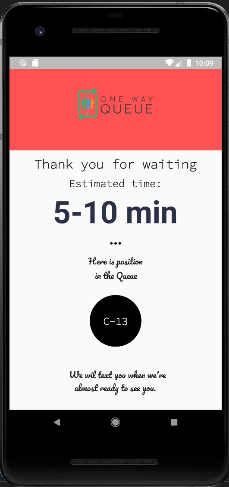
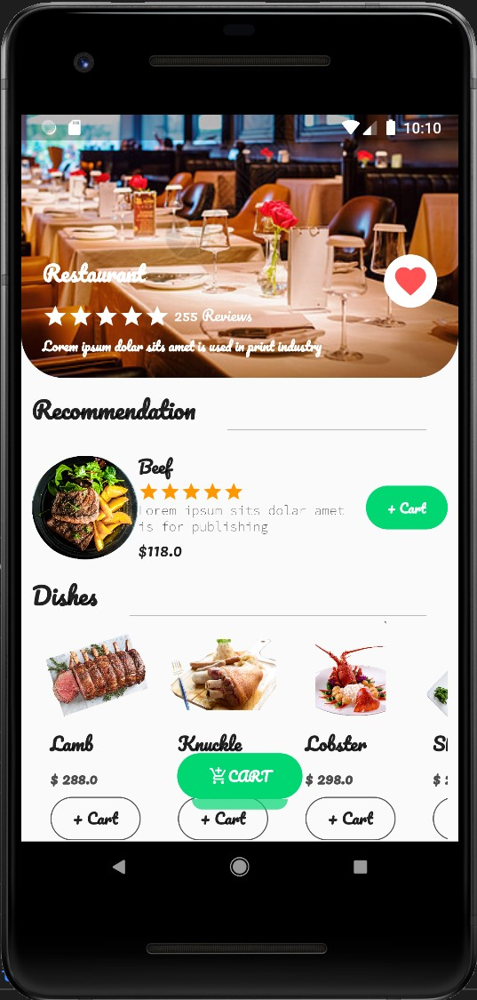
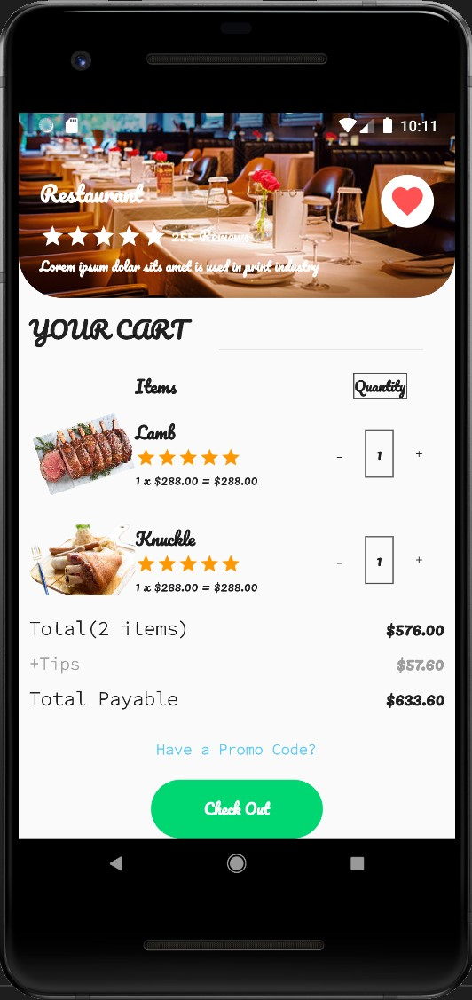

## Project: SMART QUEUE

## Team Memebers
* CHOI Ji-Hoon
* Hau Yi Shan
* Tong Ka Hei
* Chan Ka Chun
* Chan Hei
* NING Tongqi

## Description of the Project

Due to its small area of land and high population, Hong Kong ranks 4th in population density in the world. As there is a saying that “Hong Kong restaurants sell food to pay the rent”, such situation naturally leads to a high housing price and rental price for businesses. 

This indicates that turnover rate for restaurants in Hong Kong is crucial for sustainable business operation. Thus, most of the restaurants, especially the ones run by corporates, adapt queuing system to maximize the turnover rate. 

However, it often leads to unsatisfying customer experience and our project is to tackle this issue with our new system.

## 3 Most Impactful Features of the Project

- Provide customers with simple and useful queuing and ordering procedures.
- Provide cost-efficient and powerful solutions to facilitate both queuing and ordering processes for restaurant managers.
- Customers can choose to pay on their mobile devices or in person.

## Demo Page

| `Input Page` | `Information Page` | `Menu Page` | 
| :---: | :---: | :---: | 
| ** | |  
| `Ordering Page` | `Cart Page` | `Checkout Page` |
| |  | |
